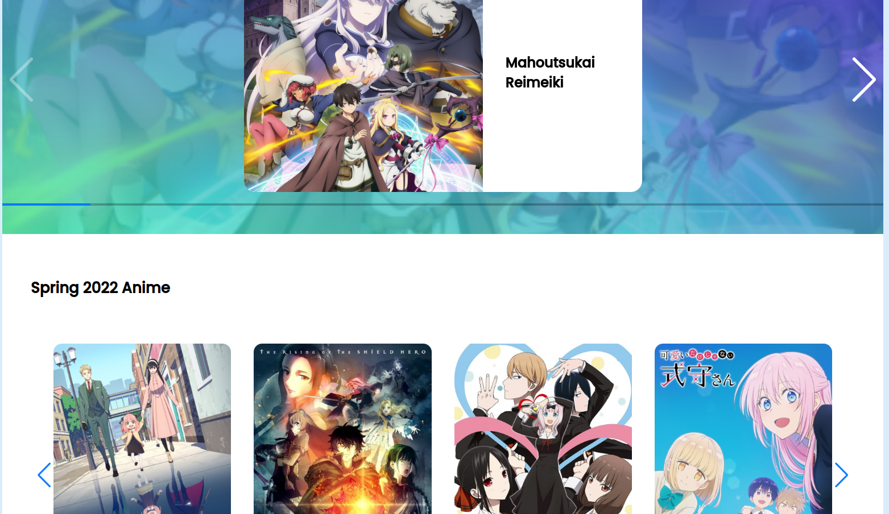
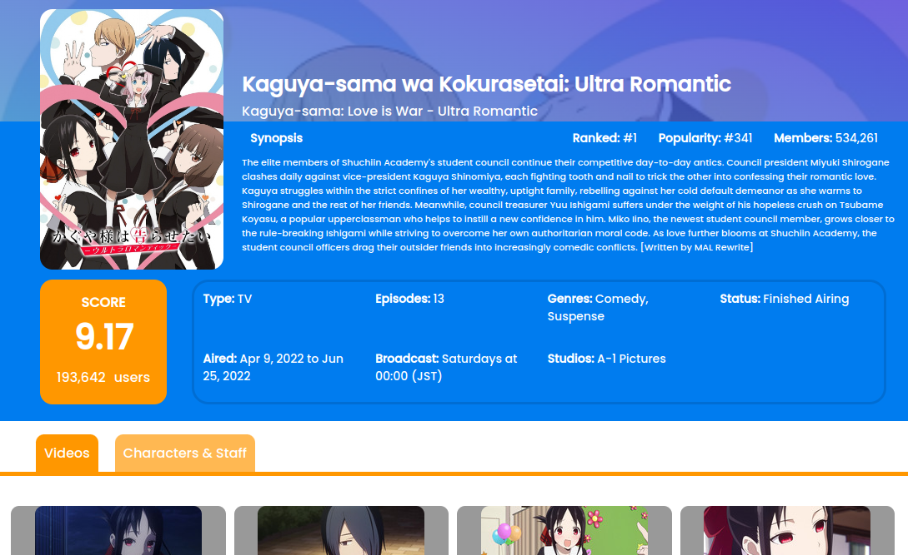

# jikan-anime-blog
A web page that show content comming from Jikan API
## Table of Contents

* [General Info](#general-information)
* [Technologies Used](#technologies-used)
* [Screenshots](#screenshots)

## General Information

The web page is a static web page that is working with data that come from <a href="https://docs.api.jikan.moe/">Jikan API</a>

The UI design used is <a href="https://cdn.dribbble.com/users/6042764/screenshots/14879802/media/c8b5f0ec4e05844152970921f655e2d1.png">MyAnimeList - Website Redesign</a>, it's available on dribbble.

The project is deployed on heroku follow this <a href="https://jikan-anime-blog.herokuapp.com">link</a>

## Technologies Used
- HTML 
- CSS
- Javascript
- jQuery
- UnderscoreJS
- <a href="https://swiperjs.com/">Swiperjs</a>
## Screenshots

